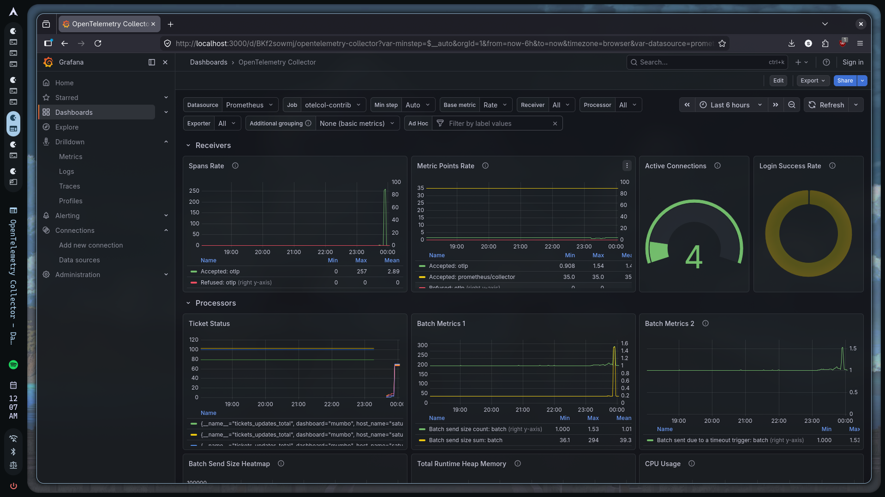

# Ticketing System 

- Project written for funtasia

- Frontend by claude, everything else by my pet cat (maiself)

**Web Link**: 
- https://ticketing.saturday-s.com/mumbo
- https://ticketing.saturday-s.com/prata

**Admin Page**: https://ticketing.saturday-s.com/admin (Password: House that starts with S)

Tech Stack:
- Frontend: React, JS, TS
- Backend: Node.js (Express), PM2
- Database: PostgreSQL
- Realtime: Socket.io
- Monitoring & Observability: OpenTelemetry, Grafana, LGTM, Tempo (Traces), Mimir/Prometheus (Metrics)
- Load Testing: k6
- Reverse Proxy: Nginx
- Infra: Cloudflare, Docker
- IaC: Terraform

---

# Architecture Review

```
React Frontend
      │
      ▼
Cloudflare Tunnel / Nginx Reverse Proxy
      │
      ▼
Node.js (Express) Backend [Port 3001]
      ├── PostgreSQL
      ├── Socket.io (Real-time updates)
      └── OpenTelemetry instrumentation
```
---

## PostgreSQL Database


```sql
CREATE TABLE tickets (
  id        SERIAL PRIMARY KEY,
  num       INTEGER NOT NULL,
  dashboard TEXT NOT NULL CHECK (dashboard IN ('mumbo', 'prata')),
  status    TEXT NOT NULL CHECK (status IN ('idle', 'preparing', 'ready')) DEFAULT 'idle',
  UNIQUE (num, dashboard)
);
```
---

## Auth

Uses JWT, single admin account single password

---

## Obervability & Monitoring



Data Pipeline
- Traces → Tempo
- Metrics → Prometheus / Mimir
- Visualisation → Grafana

---

## Real-time Updates

Socket.io broadcasts updates instantly to connected display clients which are  grouped by dashboard rooms :D

### Events

- `ticket_update` — emitted when a ticket status changes  
- `ticket_reset` — emitted when all tickets are reset

---

## Stress Test

- Tested with [k6](https://k6.io) simulating 710 concurrent virtual users across three scenarios simultaneously: display polling, admin updates, and socket connections

| Metric | Result | Threshold | Status |
|---|---|---|---|
| p(95) response time | 399ms | < 800ms | yay! |
| Error rate | 3.4% | < 5% | yay! |
| p(99) ticket fetch latency | 871ms | < 1500ms | yay! |
 
**Scenario breakdown**
- **200 VUs** ramping up polling `GET /tickets/:dashboard` — median response 25ms
- **10 VUs** hammering admin login + `PATCH /tickets` — 97% success rate
- **500 VUs** holding concurrent WebSocket connections — handled cleanly
**Summary**: median API response time of 25ms under full load, server stayed stable throughout. Comfortably handles hundreds of simultaneous display screens.
 
---


## Future Improvements

- Proper admin management (This can be done with supabase auth)
- LGTM stack split into seperate k8 clusters for future scalability
- Redis adapator for sokket.io
- Add cats


